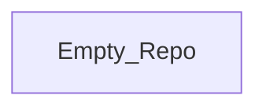

## Stack
- No manifest files found at repo root (no package.json, go.mod, pyproject.toml, or Cargo.toml).
- No source files or entry points present.
- Repo currently contains only `README.md` (single line: "# Figma_Frontend_Degine") and `.git`.
- This is not yet a code project — TODO: verify once source is added.

## Directory map
| path | what lives there |
|---|---|
| `/` | `README.md` (title only), `.git` (version control metadata) |

## Diagram

## Component index
- [[Empty_Repo]]

## Entry points
- Dev entry point: TODO: verify (no source files present)
- Prod entry point: TODO: verify (no source files present)

## Conventions
- None observed — repo has no code files to derive conventions from.

## Where things go
- To add the project, start by adding a manifest (`package.json` or equivalent) at repo root.
- To document a real stack once added, re-run this documentation pass against `package.json`/entry points.
- To scaffold a frontend, place source under a conventional directory (e.g. `src/`) and update this file accordingly.
